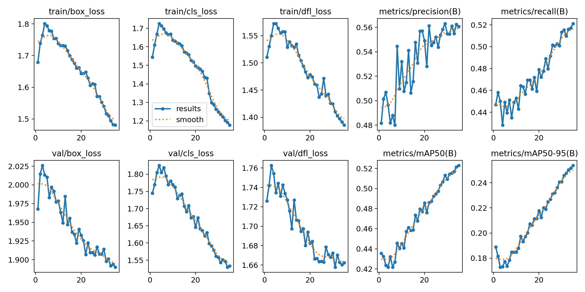

<div align="center">

# 🌾 RiceGuard

### Rice leaf disease detection with YOLOv8

[](https://github.com/Nitishvox/paddydoc)
[](https://huggingface.co/spaces)
[](https://www.python.org/)
[](https://github.com/ultralytics/ultralytics)
[](LICENSE)

**Inspect a rice leaf, compare models, and review the evidence behind each prediction.**

</div>

RiceGuard is a Gradio application for detecting **Blast**, **Blight**, **Brownspot**, and **Healthy** rice leaves from images and videos. It combines local YOLOv8 inference with an optional Roboflow-hosted model.

<div align="center">


*Example validation predictions from the best local model.*

</div>

> **Research prototype:** predictions are intended for experimentation and screening, not as a substitute for agronomist or laboratory diagnosis.

## ✨ Features

| Feature | Details |
|---|---|
| 📷 Image detection | Upload, webcam, or clipboard paste |
| 🎬 Video detection | Frame-by-frame annotated video output |
| ⚖️ Model comparison | All three models side by side |
| 📊 Training history | Full metrics and honest limitation notes |
| ⚡ Model caching | Switch models without reloading from disk |
| 🔁 Roboflow cloud | Optional RF-DETR hosted model via API |

## 🧭 Detection workflow

1. Upload a leaf image, use a webcam, or provide a video clip.
2. Select a local checkpoint or compare all local models side by side.
3. Adjust the confidence threshold and inspect annotated detections.
4. Use the optional cloud tab when a Roboflow API key is configured.

## 📈 Evaluation snapshot

The best local checkpoint is **Stage 2**, trained for 100 epochs at 832 px. Its validation mAP50 is **0.569**. The evaluation artifacts below are included in the repository so results can be inspected rather than taken on faith.

<div align="center">

| Training curves | Normalized confusion matrix |
|---|---|
|  |  |

</div>

## Models

| Model | Epochs | Resolution | mAP50 |
|---|---|---|---|
| Stage 1 (baseline) | 65 | 640 px | 0.557 |
| **Stage 2 ★ Best** | **100** | **832 px** | **0.569** |
| Fine-tune (experimental) | 115 | 832 px | 0.483 |
| Roboflow RF-DETR (cloud) | — | — | ~0.527 |

> **⚠️ Known limitation:** Blight detection recall is only ~37%. The model can confuse Blight lesions with background, so low-confidence or borderline predictions should be reviewed manually.

## 🛠️ Local setup

### Requirements

- Python 3.10 or newer
- Git LFS for downloading and working with the `.pt` checkpoints
- Optional: a Roboflow API key for the cloud model

### Install and run

```bash
# 1. Clone the repo
git clone https://github.com/Nitishvox/paddydoc.git
cd rice_disease_detector

# 2. Install dependencies
pip install -r requirements.txt

# 3. Copy env file and fill in your Roboflow key (optional)
cp .env.example .env

# 4. Run
python app.py
# → Open http://localhost:7860
```

The local YOLO models run without an API key. The `.env` file is optional and is only needed for the Roboflow integration.

## 🔐 Environment variables

Never commit `.env` or paste credentials into source files. Copy the template locally:

```bash
cp .env.example .env
```

| Variable | Required | Purpose |
|---|---:|---|
| `ROBOFLOW_API_KEY` | No | Enables hosted Roboflow inference |
| `ROBOFLOW_WORKSPACE` | No | Roboflow workspace identifier |
| `ROBOFLOW_WORKFLOW_ID` | No | Roboflow workflow identifier |

For Hugging Face Spaces, add these values as **Space Secrets**, not as committed files.

## 🚀 Deploy to Hugging Face Spaces

```bash
# 1. Create a new Space at huggingface.co/new-space
#    SDK: Gradio  |  Hardware: CPU Basic (free)

# 2. Install Git LFS (one time)
git lfs install

# 3. Push to the Space's repo
git remote add space https://huggingface.co/spaces/your-username/riceguard
git push space main
```

Weights (`weights/*.pt`) are tracked via **Git LFS** so they upload correctly.
Set your `ROBOFLOW_API_KEY` as a **Secret** in Space Settings if you want the cloud model.

## 📁 Project structure

```
rice_disease_detector/
├── app.py                  # Gradio UI — entry point
├── config.py               # Model registry, paths, env config
├── models/
│   ├── yolo_handler.py     # Local YOLOv8 inference + caching
│   └── roboflow_handler.py # Roboflow Workflows API + retry logic
├── utils/
│   └── image_utils.py      # Shared helpers (resize, table format)
├── weights/
│   ├── stage1_best.pt      # Stage 1 checkpoint (21.5 MB)
│   ├── stage2_best.pt      # Stage 2 checkpoint (21.5 MB)
│   └── finetune_best.pt    # Fine-tune checkpoint (optional)
├── projec_files/           # Stage 1 training artifacts (curves, CSV)
├── project_files/          # Stage 2 training artifacts (curves, CSV)
├── requirements.txt
├── .env.example
├── .gitattributes          # Git LFS config for *.pt files
└── README.md
```

## 🧪 Training background

Trained on ~7,400 labeled rice leaf images across 4 classes using YOLOv8s on Google Colab.
Training split across sessions due to free-tier GPU limits. Full write-up in the About tab of the app.

## 📄 License

MIT
